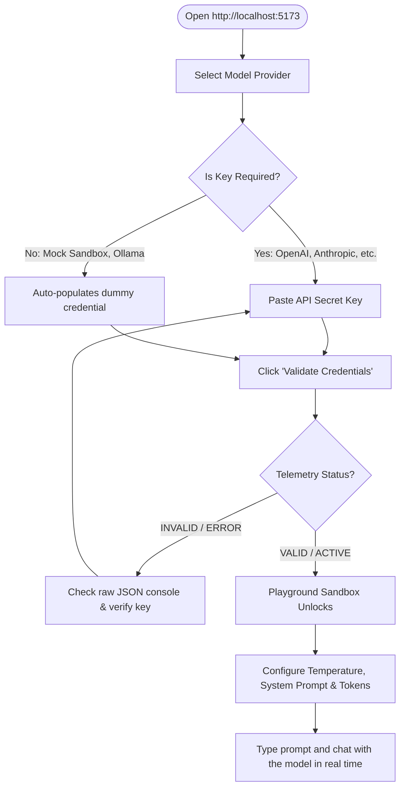

# TestKeyAPI // Unified LLM Sandbox & Validator (React + Vite)

TestKeyAPI is an ultra-premium, local developer utility designed to validate API Secret Keys across 10 different AI models and providers, immediately unlocking an interactive chat sandbox playground. 

This version is built as a modern **React.js** web application scaffolded with **Vite**, backed by a lightweight **Node.js Express proxy** to handle CORS bypasses.

---

### 📖 Quick Start Checklist
* 📦 **1. Install**: Run `npm install` in the project root.
* 🚀 **2. Launch**: Run `npm run dev` to start both the Express backend (port 3000) and the Vite frontend (port 5173).
* 🌐 **3. Open**: Visit **[http://localhost:5173](http://localhost:5173)** in your browser.
* 🔑 **4. Verify**: Select **Mock Sandbox**, click **Validate Credentials** to test latency and see simulated chat in action.

---

## 🎯 What TestKeyAPI Can Do (Core Capabilities)

TestKeyAPI is a developer-centric toolbox built to solve common API debugging, validation, and playground testing bottlenecks:

*   🔒 **Validate API Keys Instantly**: Check if your secret keys for OpenAI, Anthropic, Gemini, Groq, OpenRouter, DeepSeek, Mistral, and Cohere are valid, active, and have positive credit balances, without writing or deploying any testing code.
*   ⚡ **Debug Network Latency**: Automatically tracks round-trip connection times (in milliseconds) for API requests, helping you compare response latency between model providers (e.g., Groq vs. OpenAI).
*   📊 **Inspect Usage Metrics**: Measures input, output, and total token usage counts returned by the providers to estimate payload cost parameters.
*   🔍 **Examine Raw JSON Payloads**: Displays exact raw JSON responses from AI servers, allowing you to debug returned schemas, rates, system properties, and direct API errors (like `401 Unauthorized` or `429 Quota Exceeded`).
*   💬 **Playground Chat Sandbox**: Test models under custom parameters: edit system instructions, limit output token lengths, modify temperature values, and chat in multi-turn threads.
*   🔌 **Local Ollama Integration**: Seamlessly connect to your locally running LLMs (on port 11434) to validate parameters before using them in code.

---

## 🚀 Key Features

- **⚛️ React State Engine**: Reactive state-driven UI built with modern React hooks (`useState`, `useEffect`, `useRef`).
- **🌐 Multi-Provider Gateways**: Pre-configured integration for:
  - **OpenAI** (including `gpt-4o`, `gpt-4o-mini`, `o1-preview`)
  - **Anthropic** (`claude-3-5-sonnet`, `claude-3-5-haiku`, `claude-3-opus`)
  - **Google Gemini** (`gemini-2.5`, `gemini-2.0-flash`, `gemini-1.5`)
  - **Groq** (`llama-3.3-70b`, `llama-3.1`, `deepseek-r1-distill`)
  - **OpenRouter** (`deepseek-r1`, `deepseek-chat`, free-tier models)
  - **DeepSeek (Direct)**, **Mistral AI**, and **Cohere**
  - **Ollama (Local)** (for testing local models running on your machine)
- **🧪 Mock Sandbox**: Built-in credential validator and chat simulator to test the entire tool without entering real keys.
- **⚡ Real-time Telemetry**: Captures execution latency (down to the millisecond) and monitors token usage counts.
- **💻 Developer Console**: Syntactically highlights and inspects raw API JSON response payloads.
- **💬 Unified Playground**: Activates a multi-turn chat environment with configurable temperature sliders, max token settings, and custom system prompts.
- **🗺️ Internationalization**: Dynamic UI localizer supporting **English (EN)**, **Khmer (KM)**, **Spanish (ES)**, **Chinese (ZH)**, and **Japanese (JA)**.
- **🗃️ Credentials CRUD Database**: Save, edit, rename, and delete validated key configurations locally (stored securely in browser `localStorage` for instant loading and quick multi-provider testing).
- **🚀 Postman Client Mode**: Send general-purpose raw HTTP requests (`GET`, `POST`, `PUT`, `DELETE`, `PATCH`) with custom header JSON and body structures. Requests are proxied through the local backend to bypass browser CORS constraints, measuring real-time latency and rendering response payloads.
- **📖 Onboarding Documentation**: A built-in user guide modal available at a click directly in the interface.

---

## 🛠️ Getting Started

### 1. Prerequisites
Ensure you have **Node.js** (v18 or higher recommended) installed on your system.

### 2. Installation
Navigate to the project root directory and install dependencies:
```bash
npm install
```

### 3. Running the Application
Start both the Express API server and Vite dev server concurrently:
```bash
npm run dev
```
The application will boot up at:
👉 **[http://localhost:5173](http://localhost:5173)**

*Note: Vite handles proxying of `/api/...` requests to the Node server on port 3000 automatically.*

---

## 🕹️ Step-by-Step Usage Guide



### Step 1: Select a Provider & Model
1. Open the browser to `http://localhost:5173`.
2. Under **Configure Provider**, select a provider from the dropdown. 
3. *For testing*: Choose **Mock Sandbox** (auto-fills a test key) or **Ollama (Local)** (bypasses key validation).
4. Select your target Model. Enable the **Custom Model** toggle if you wish to type in a specific model snapshot.

### Step 2: Authenticate
1. Paste your API secret key into the input field. 
2. Click the **Eye Icon** (<i class="ph-light ph-eye"></i>) to toggle character visibility and inspect your key string.

### Step 3: Verify & Review Diagnostics
1. Click **Validate Credentials**. 
2. Watch the live **Telemetry & Metrics** gauge:
   - **Status**: Changes to `VALIDATING` then `VALID` (green) or `INVALID` (red).
   - **Latency**: Monitors connection speed in milliseconds.
   - **Token Usage**: Measures validation prompt token costs.
3. Review the raw response payload JSON from the provider's API gateway inside the console box. Use the copy button to copy it.

### Step 4: Access Sandbox Chat
1. Upon successful verification, the **Sandbox Playground** at the bottom will unlock.
2. Optional: Expand **Advanced Parameters** to configure a custom *System Prompt*, *Max Return Tokens*, or *Temperature* slider.
3. Chat with the model in real time. Code fragments, bold formatting, and bullet points will automatically render in the bubbles.

---

## 📂 Project Directory Structure

```
├── src/
│   ├── App.jsx      # Main React application component, state, and translation dict
│   ├── index.css    # Ambient mesh background, double-bezels, responsive grids
│   └── main.jsx     # Vite React application entry mounting element
├── public/          # Static browser assets
├── server.js        # Express Node proxy routing requests securely (CORS bypass)
├── vite.config.js   # Vite server proxy target routing configurations
├── package.json     # Concurrently scripts and app dependency list
└── README.md        # Project setup and user guide (this document)
```

---

## ⚙️ How It Works (Technical Architecture)

AetherKey is designed with a hybrid client-server model to provide a seamless, secure, and CORS-free developer experience:

### 1. The CORS Problem & Local Express Proxy
Many AI providers (such as Anthropic) enforce strict CORS (Cross-Origin Resource Sharing) headers that block browsers from making direct API calls from custom local origins like `http://localhost:5173`. 
* **Proxy Solution**: Express (`server.js`) acts as a secure backend gateway. Because CORS policies are enforced exclusively by the browser sandbox, server-to-server HTTP requests bypass CORS limitations.
* **Vite Integration**: In development, Vite's server config (`vite.config.js`) captures any front-end API requests to `/api/...` and proxies them to the backend Node process running at `http://localhost:3000`.

```
[React App (5173)] ---> [Vite Dev Proxy] ---> [Express Server (3000)] ---> [Provider API (HTTPS)]
```

### 2. Request Data Normalization
Each AI provider requires a unique JSON layout structure. The local proxy server normalizes standard message logs:
* **OpenAI, Groq, OpenRouter, DeepSeek, Mistral**: Receives standard messages array. Prepends the system prompt as a `{ role: 'system' }` message inside `messages`.
* **Anthropic**: Isolates any system prompts into a standalone root `system` string, filters out non-human roles, and maps remaining elements to the `messages` array.
* **Google Gemini**: Transforms standard messages into a parts-based structure: `{ role: 'user'|'model', parts: [{ text }] }`, attaching system instructions in the `systemInstruction` config object.
* **Ollama**: Automatically forwards requests to a locally running instance at `http://localhost:11434` utilizing native OpenAI compatibility.

### 3. Active Telemetry Monitoring
* **Latency Check**: When you validate your credentials, a high-precision JavaScript clock measures the round-trip response time (latency) in milliseconds and renders the result dynamically in the telemetry block.
* **Raw JSON Inspector**: The backend returns the raw API response headers and body payload. The front-end renders this JSON directly inside the syntax-styled codeblock, allowing developers to debug headers, token counts, or errors.
* **State Unlocking**: Upon receiving a `success: true` flag from the validator endpoint, React updates the `isValidated` state, triggering a CSS transition that slides out the blur overlay and unlocks the chat panel.

